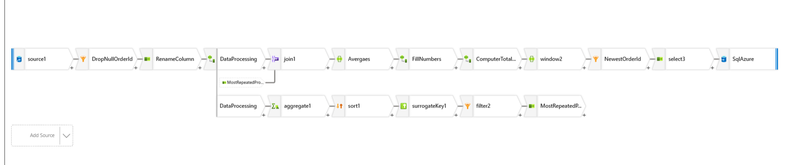
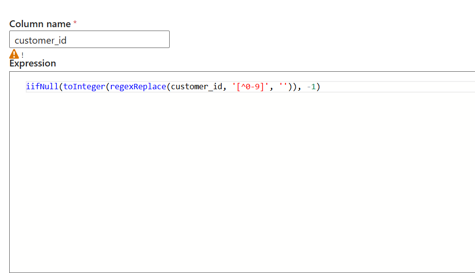
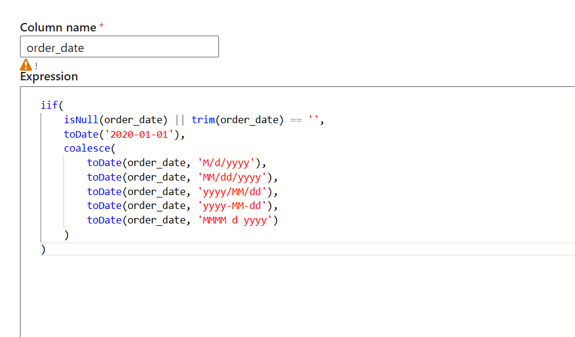
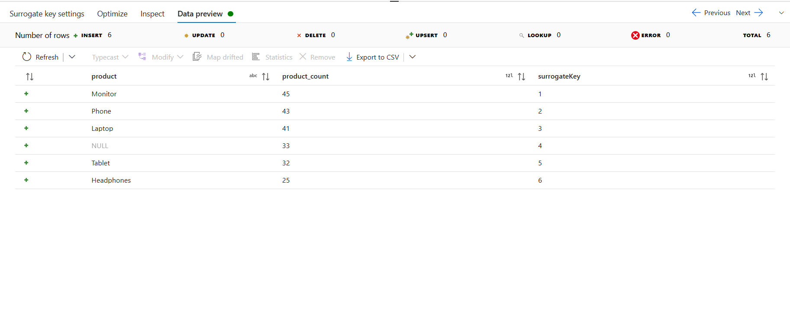
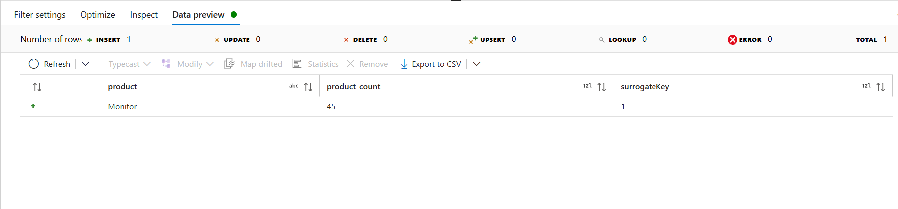
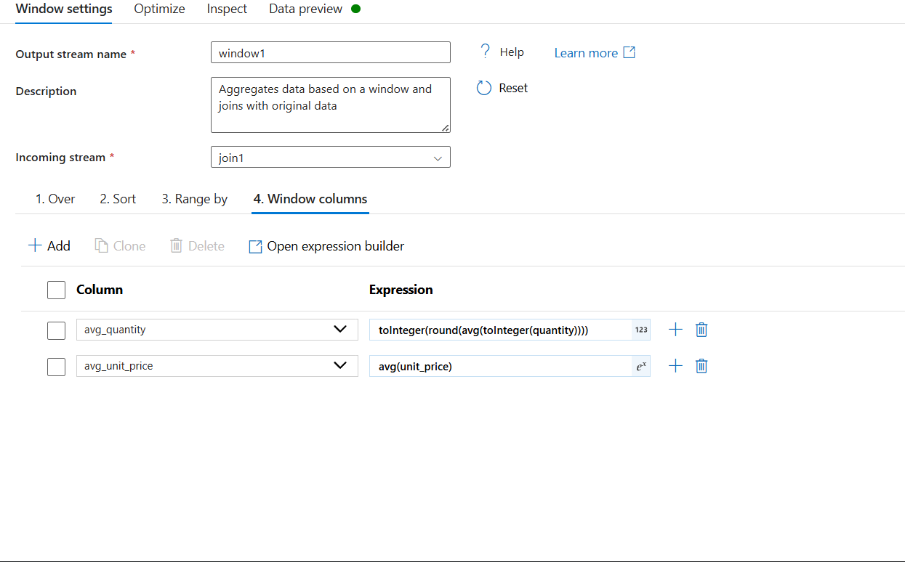
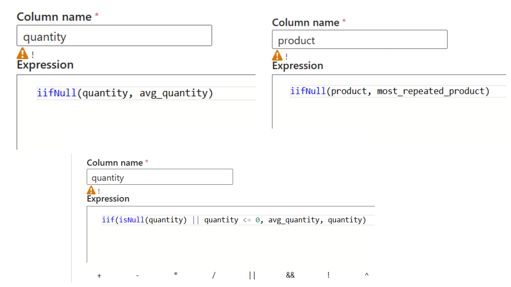
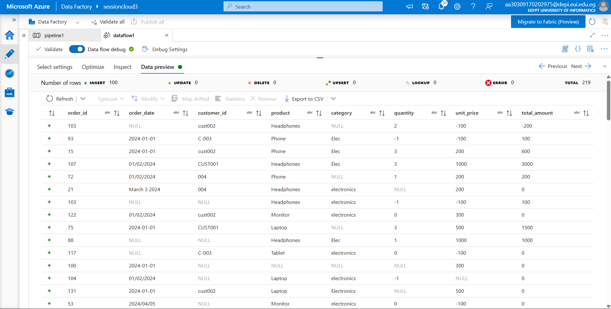
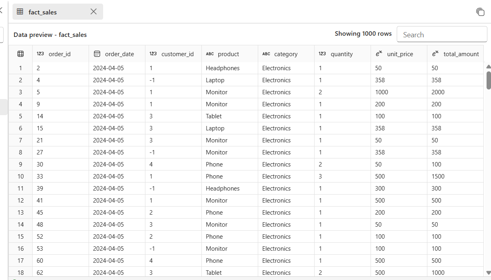
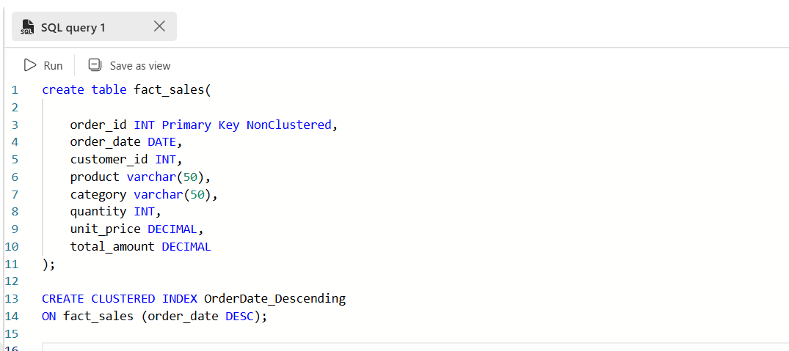

# 🚀 Azure Data Engineering: Sales Data ETL Pipeline

## 📌 Project Overview
This project demonstrates an end-to-end Data Pipeline built using **Azure Data Factory (ADF)**. The goal is to transform raw, messy Sales CSV data (containing missing values, inconsistent date formats, and duplicates) into a structured, analysis-ready **Azure SQL Database** fact table, following **Medallion Architecture** principles.

---

## 🛠️ Tech Stack
- **Azure Data Factory (ADF):** Orchestration & Data Flow.
- **Azure SQL Database:** Final Sink (Fact Table).
- **Azure Data Lake Storage (Gen2):** Storage for Raw Data.
- **Spark Engine:** High-performance compute for transformations.

---

## 🏗️ Pipeline Architecture
The pipeline is optimized to ensure data integrity through a sequential literal flow.



---

## 🔍 Data Flow Step-by-Step Walkthrough

### 1️⃣ Ingestion & Initial Hardening
* **Source:** Loads the raw CSV file. 
* **Filter (filter1):** Drops rows with `NULL` order IDs immediately.
* **Derived Column (derivedColumn1):** Performs initial casting and regex cleaning for IDs.
    * 
    * 

### 2️⃣ Statistical Mode Branch (Product Imputation)
* **Aggregate & Sort:** Groups by product to find the frequency.
    * 
* **Surrogate Key & Filter:** Isolates the single most frequent product (The Mode).
    * 

### 3️⃣ Global Imputation & Metric Calculation
* **Join & Window:** A Cross Join brings the Mode value to every row, while a Window transformation calculates the global `avg_price` and `avg_quantity`.
    * 
* **Derived Column 2:** Fills missing values for Product, Quantity, and Price using the calculated stats.
    * 
* **Derived Column 3:** Computes the `total_amount` after all previous values are imputed.


### 4️⃣ Deduplication & SQL Loading
* **Window & Filter:** Uses `rowNumber()` over `order_id` to keep only the newest record.
* **Sink:** Maps the cleaned data into the SQL `fact_sales` table.

---

## 📊 Data Quality Comparison (Before vs After)

**Raw Data Sample (Input):**


**Cleaned Data Sample (Output):**


---

## 🗄️ SQL Database Optimization
The final data is loaded into `fact_sales`. To optimize for analytical reporting, a **Clustered Index** was implemented on the date column.



```sql
-- Enhancing physical storage order
CREATE CLUSTERED INDEX IX_OrderDate_Descending 
ON fact_sales (order_date DESC);